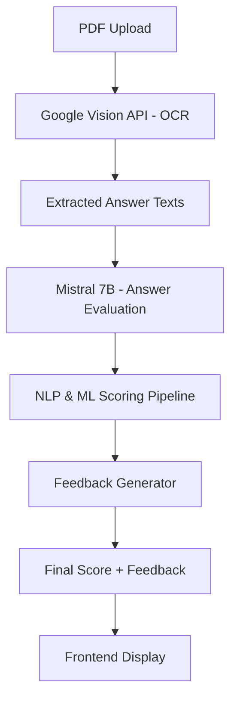

# 📝 Automated Answer Sheet Grading System

**AI-powered evaluation of handwritten student answers with feedback, accuracy, and elegance.**


Welcome to the **Automated Answer Sheet Grading System** — an advanced platform built using cutting-edge **AI, NLP, OCR, and LLMs** that automates the evaluation of handwritten student responses from scanned answer sheets. Designed to provide accurate scores **and personalized feedback**, this project makes grading efficient, insightful, and scalable.

---

## 📌 Table of Contents

* [🚀 Features](#-features)
* [🧠 Tech Stack](#-tech-stack)
* [🖼️ Architecture](#-architecture)
* [⚙️ Installation](#-installation)
* [🌐 Usage](#-usage)
* [🔍 Evaluation Pipeline](#-evaluation-pipeline)
* [📂 File Structure](#-file-structure)
* [🤝 Contributing](#-contributing)
* [📜 License](#-license)

---

## 🚀 Features

✅ **Automatic Grading** of handwritten answers from scanned PDFs
✅ **Google Vision OCR API** for accurate handwritten text extraction
✅ **Mistral 7B (via Ollama)** for deep semantic evaluation
✅ **Advanced NLP** using techniques like cosine similarity, sentiment analysis, coherence scoring
✅ **Feedback Generator** for each answer
✅ **Interactive UI** built with Flask & Bootstrap
✅ **High Accuracy (89%)** across various answer formats
✅ **Works on PDF Answer Sheets** with clean output and scoring breakdown

---

## 🧠 Tech Stack

| Technology                            | Role                                |
| ------------------------------------- | ----------------------------------- |
| **Python**                            | Core programming language           |
| **Flask**                             | Web framework                       |
| **Google Vision API**                 | OCR for extracting handwritten text |
| **Mistral 7B (Ollama)**               | LLM for deep answer evaluation      |
| **NLP (NLTK, Sklearn, Transformers)** | Text processing & similarity        |
| **Bootstrap, HTML/CSS**               | Frontend design                     |
| **Jupyter Notebooks**                 | Development and testing             |

---

## 🖼️ Architecture



---

## ⚙️ Installation

1. **Clone the repository**

   ```bash
   git clone https://github.com/yourusername/answer-evaluation-system.git
   cd answer-evaluation-system
   ```

2. **Create a virtual environment**

   ```bash
   python -m venv venv
   source venv/bin/activate  # Windows: venv\Scripts\activate
   ```

3. **Install required packages**

   ```bash
   pip install -r requirements.txt
   ```

4. **Start Ollama & Load Mistral 7B**

   ```bash
   ollama run mistral
   ```

5. **Run the application**

   ```bash
   python admin.py
   ```

---

## 🌐 Usage

1. Open your browser and go to `http://127.0.0.1:5000`
2. Upload a scanned PDF answer sheet
3. Click "Evaluate"
4. View:

   * Individual question scores
   * Personalized feedback
   * Overall score

---

## 🔍 Evaluation Pipeline

Each answer is passed through a pipeline of models and scoring functions:

* 🔤 **OCR**: Handwriting extracted using Google Vision API
* 🧽 **Preprocessing**: Tokenization, Lemmatization
* 📊 **Matching Metrics**:

  * Exact Match
  * Partial Token Overlap
  * Cosine Similarity (TF-IDF)
* ❤️ **Sentiment Analysis**: Understands tone and effort
* 💡 **Semantic Scoring**: Using Mistral 7B (via Ollama)
* 🧠 **ML Classification**: Naive Bayes for probabilistic scoring
* 🧭 **Feedback**: Dynamic feedback based on gaps/match
* ⚖️ **Weighted Score**: Final score based on multiple criteria

---

## 📂 File Structure

```bash
answer-evaluation-system/
├── admin.py                  # Main Flask app
├── ocr_module.py             # Google Vision OCR logic
├── evaluation.py             # Scoring logic and ML models
├── feedback_generator.py     # Personalized feedback generation
├── templates/
│   ├── index.html            # Frontend UI
├── static/
│   └── styles.css            # UI styling
├── screenshot/
│   ├── preview.gif           # App preview
│   └── evaluation_demo.gif   # Evaluation process
└── requirements.txt          # Dependencies
```

---

## 🤝 Contributing

Contributions are welcome! Feel free to:

* ⭐ Star this repo
* 🐛 Report issues
* 📥 Submit PRs with improvements or new features

---

## 📜 License

This project is licensed under the [MIT License](LICENSE).

---

## 📣 Acknowledgements

* [Google Cloud Vision API](https://cloud.google.com/vision)
* [Ollama + Mistral 7B](https://ollama.com)
* [HuggingFace Transformers](https://huggingface.co)
* \[NLTK, Scikit-learn, Flask]

---

## 🔐 Authentication

To use the Google Vision API, you need to provide a **service account key** from Google Cloud.

1. Go to your [Google Cloud Console](https://console.cloud.google.com/).
2. Create a service account and download the credentials JSON.
3. Rename it to `service_account.json` and place it in the project root.
4. **Do NOT commit this file.** It's listed in `.gitignore` for your safety.

You can refer to `service_account_example.json` for the required structure.

